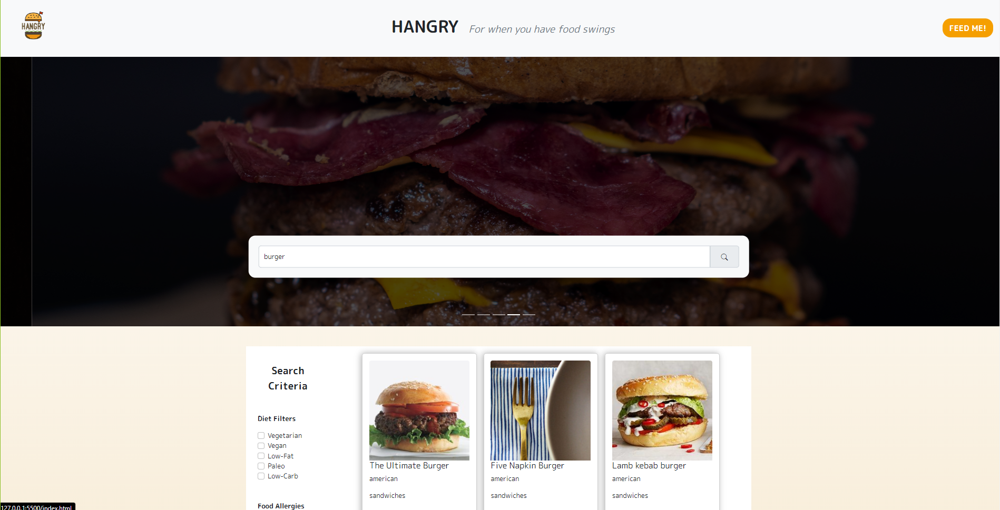

# Hangry

## Your Task

Collaborate with a group of developers to create an application that solves real-world problems.

## User Story

```md
AS A user who is hungry
I WANT to search inside an application
SO THAT I can display recipe results based on user input
```

## Acceptance Criteria

- WHEN I open the application
- THEN I am presented with 6 random recipes displayed on the page
- WHEN I click on the 'Feed Me' button inside the header
- THEN I am able to display a new set of 6 random recipes
- WHEN I input text in the search bar
- THEN I am presented with 6 search results based user input
- WHEN I select search criteria filters
- THEN I am able to apply those filters to the search results
- WHEN I click on a button to show more results
- THEN I am presented with 6 new random recipes based on user input
- WHEN I hover over a results recipe card
- THEN I am able to view the Nutritional Value of the recipe and I am able to click on the link that takes me to the recipe website

The following link deploys the application:

[Hangry App](https://mandiebot.github.io/Hangry/)


